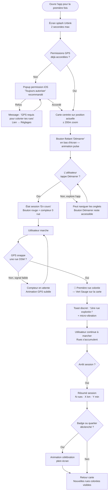
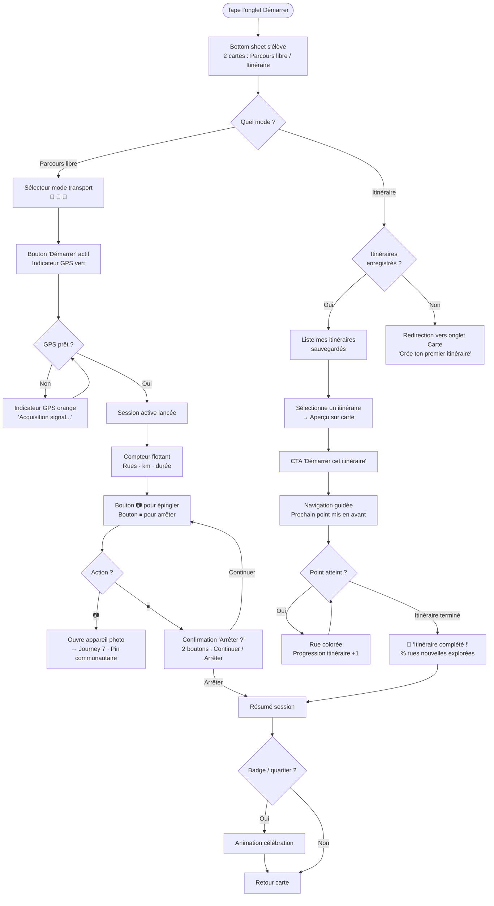
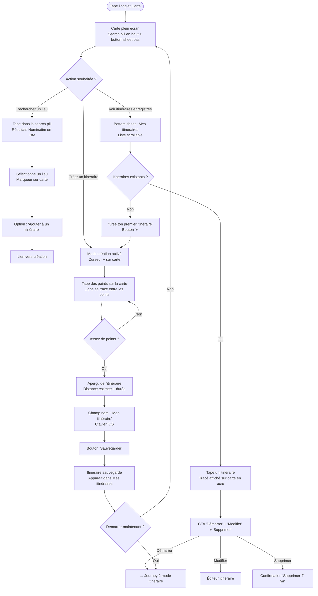
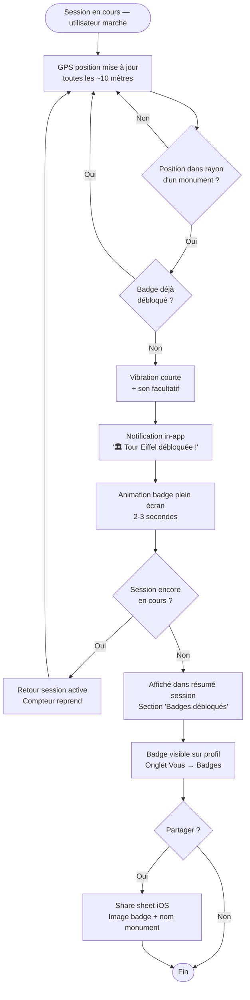
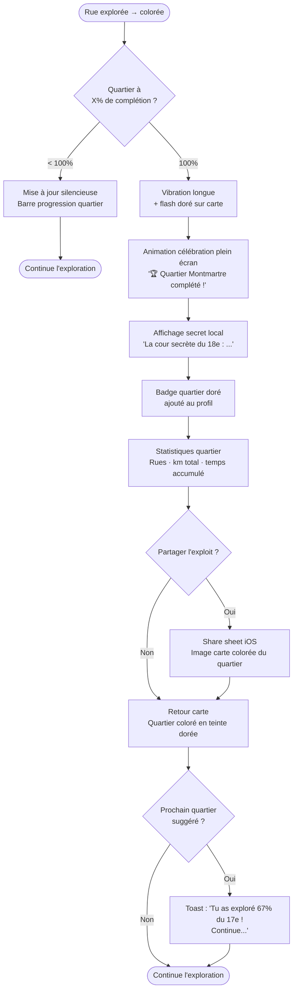
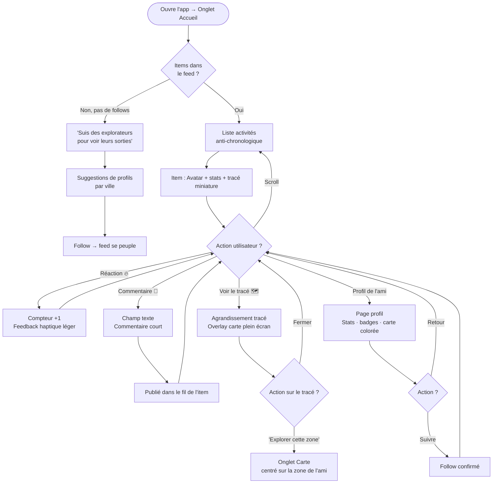
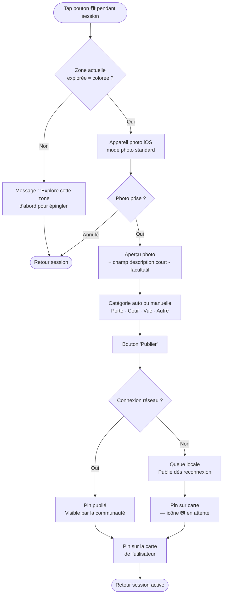
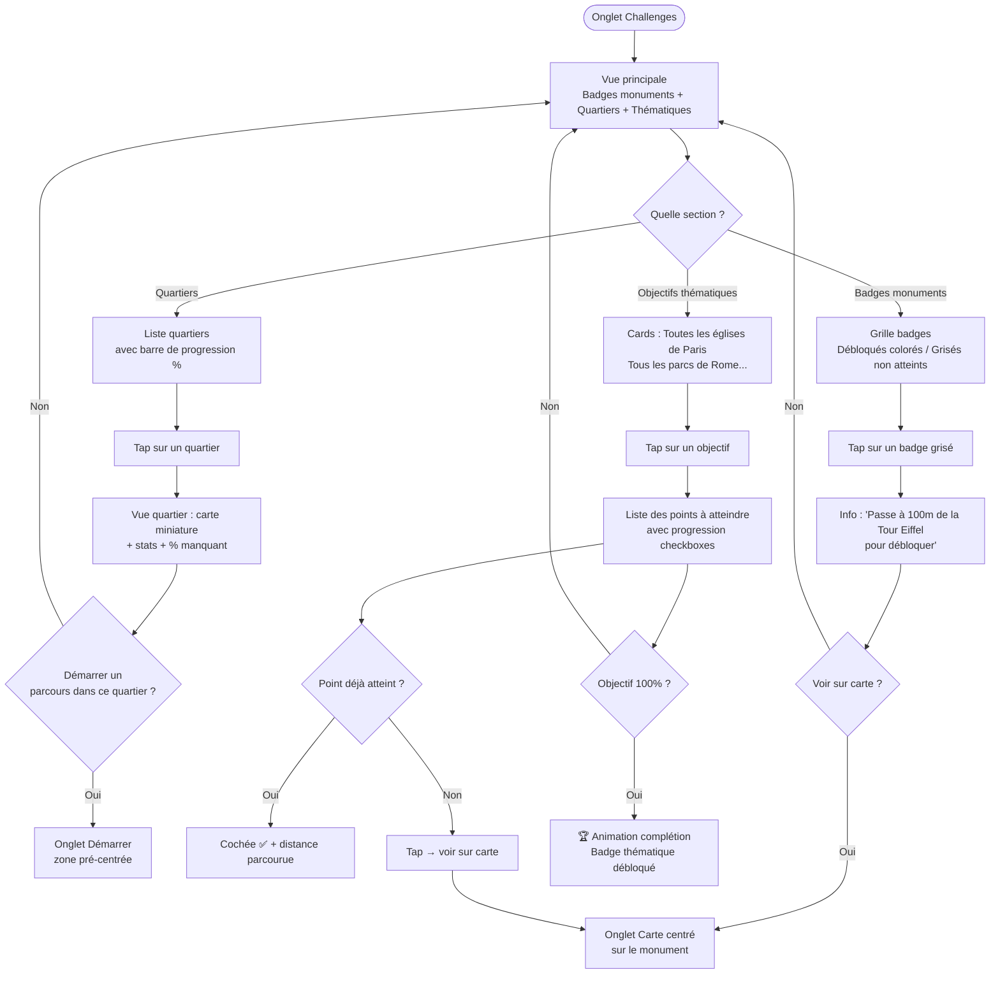

# UX Design Specification Urbink

**Author:** Jo
**Date:** 2026-04-07

---

<!-- UX design content will be appended sequentially through collaborative workflow steps -->

## Core User Experience

### Defining Experience

L'action core d'Urbink est : **marcher → voir sa rue se colorier**. Tout le reste (gamification, parcours, social) est une conséquence de ce moment fondateur. Si cette boucle GPS → snap to road → coloration est fluide et rapide (< 1 seconde de latence perçue), le produit fonctionne. C'est le risque technique #1 et la priorité UX #1.

### Platform Strategy

- **Plateforme :** iOS uniquement au MVP (Flutter), Android V2
- **Contexte d'usage :** extérieur, en mouvement, smartphone en main ou en poche
- **Contraintes plateforme :**
  - Plein soleil → contraste élevé obligatoire sur la carte
  - Une main → boutons d'action dans la zone pouce (bas d'écran)
  - Micro-déconnexions réseau → gestion gracieuse des erreurs Nominatim
  - GPS continu → impact batterie, l'utilisateur est sensible à ça

### Effortless Interactions

Interactions qui doivent être sans friction absolue :

1. **Démarrer une session** — un tap, pas de configuration
2. **Voir sa progression** — la carte est l'écran principal, toujours visible, toujours à jour
3. **Générer un parcours** — un tap + sélection durée → circuit généré en < 3 secondes
4. **Épingler une photo** — appui long sur zone explorée → formulaire minimal → publier en < 30 secondes

### Critical Success Moments

| Moment | Enjeu |
|---|---|
| **Première rue colorée** | < 60 secondes après installation — sinon drop garanti |
| **Premier badge débloqué** | Premier feedback émotionnel — décide si l'utilisateur revient |
| **Complétion d'un premier quartier** | Moment de fierté + secret local — ancre comportementale |
| **Partage de la carte colorée** | Viral loop — si l'image est belle, elle est partagée |

### Experience Principles

1. **La carte parle d'abord** — chaque écran sert la carte, pas la remplace. Overlays et sheets légers et fermables d'un geste.
2. **Zéro friction à l'entrée** — authentification anonyme Firebase dès le lancement, aucun compte requis. Explorer avant de comprendre.
3. **Le feedback est immédiat** — chaque action (rue colorée, badge, session) reçoit un retour visuel ou animé immédiatement.
4. **Célébrer l'exploration** — les moments de complétion sont des fêtes visuelles, pas des toasts discrets. L'émotion est le moteur de rétention.
5. **Le téléphone reste en poche** — l'app fonctionne en arrière-plan. L'utilisateur ne doit pas regarder son écran pour que les rues se colorient.
6. **Tu dois y avoir été** — une photo ne peut être épinglée que sur une zone déjà explorée (rue colorée). Appui long sur zone non colorée → message discret "Explorez cette zone d'abord". Le contenu communautaire est authentique par construction.

---

## 2. Core User Experience

### 2.1 Defining Experience

**"Marcher dans une rue → la voir se colorier sur la carte."**

C'est le moment Urbink. Comme Tinder c'est le swipe, Urbink c'est la coloration en temps réel. Tout le reste — gamification, social, parcours — amplifie ce moment mais ne le remplace pas.

### 2.2 User Mental Model

L'utilisateur arrive avec le modèle Google Maps : une carte statique où il cherche un itinéraire. Urbink renverse ce modèle : **la carte réagit à ses mouvements**, pas l'inverse. C'est une rupture cognitive légère — la première rue colorée doit apparaître en < 60 secondes pour que le modèle mental bascule avant que l'utilisateur abandonne.

Les utilisateurs de Fog of World ou CityStrides comprennent déjà ce modèle. Les autres le découvrent par l'expérience directe, pas par un tutoriel.

### 2.3 Success Criteria

- La rue colorée apparaît en < 1 seconde après passage GPS
- La couleur est suffisamment distincte pour être visible en plein soleil
- L'utilisateur lit l'état de sa session d'un coup d'œil (en cours / pause / arrêt)
- Aucune action requise pour que les rues se colorient — ça arrive automatiquement en arrière-plan

### 2.4 Novel UX Patterns

Pattern familier (GPS tracking, connu via Strava/Google Maps) + twist Urbink : **la carte s'enrichit visuellement à chaque session**. Ce n'est pas un tracé qui s'affiche puis disparaît — c'est un territoire personnel qui grandit de façon permanente et irremplaçable. Pas besoin d'éduquer sur le GPS. Besoin de montrer que le résultat est différent de tout ce qu'ils connaissent.

### 2.5 Experience Mechanics

**Initiation :** Bouton FAB central "Démarrer" dans la bottom nav — un tap. Le bouton passe immédiatement de Vert Sauge ▶ (repos) à Ocre ⏸ (session active), et un bouton Arrêter rouge circulaire apparaît en haut à droite.

**Interaction :** L'utilisateur marche, l'app tourne en arrière-plan. Toutes les 10 mètres, Nominatim snappe la position GPS à la rue OSM la plus proche. La rue se colorie progressivement — comme un surligneur qui suit l'utilisateur avec un léger délai naturel.

**Feedback :**
- Visuel : la rue se colorie en temps réel sur la carte
- Compteur discret en haut : "12 rues explorées" mis à jour en continu
- Aucun son ni vibration pendant l'exploration normale

**Complétion :** L'utilisateur appuie sur "Arrêter". Session sauvegardée. Si badge ou quartier déclenché → animation célébration plein écran. Sinon → retour carte avec nouvelles rues colorées visibles.

---

## UX Pattern Analysis & Inspiration

### Inspiring Products Analysis

**Strava** — Structure du post activité : carte miniature + métriques (durée, distance, dénivelé) + réactions sociales. Pattern directement transposable pour le post parcours Urbink. Points forts : le tracé sur carte miniature est immédiatement lisible, les métriques sont hiérarchisées visuellement.

**BeReal / Google Maps Contributions** — Création de contenu photo géolocalisé spontané. Le flux "prendre une photo → elle se place automatiquement sur la carte" est le pattern retenu pour les photos épinglées Urbink. Zéro formulaire intermédiaire, la géolocalisation est automatique.

**Instagram** — Modèle profil public/privé, fil d'actualité chronologique, galerie photos. Pattern retenu pour le système social d'Urbink (follow, fil, posts parcours avec galerie photos).

### Transferable UX Patterns

**Navigation :**
- Carte comme écran principal permanent (Google Maps) — pas de home screen abstrait
- Bottom navigation bar avec 4-5 onglets max pour accéder aux sections secondaires (Strava, Instagram)

**Interaction :**
- Post activité avec carte miniature + métriques + galerie horizontale photos (Strava) → post parcours Urbink
- Photo géolocalisée instantanée comme mode de création de contenu (BeReal) → Découverte Urbink
- Thumbnails photos circulaires ou carrés sur carte pour les pins (Google Maps) → thumbnails photos épinglées Urbink

**Célébration :**
- Animation plein écran à la complétion d'objectif (Duolingo) → déblocage badge / quartier complété Urbink

### Anti-Patterns to Avoid

- **Fog of War** (Fog of World) — cacher la carte crée de l'anxiété, pas de la curiosité. La carte Urbink est toujours entièrement visible.
- **Gamification agressive** (Duolingo streaks punitifs) — jamais de sentiment de culpabilité si l'utilisateur n'explore pas. Les rappels sont doux, max 1 tous les 3 jours.
- **Onboarding long** (apps avec tutoriels forcés) — première rue colorée en < 60 secondes, aucun écran bloquant.
- **Navigation profonde** (apps avec 5+ niveaux de menus) — la carte et les actions principales sont toujours à 1 tap.

### Design Inspiration Strategy

**Adopter :**
- Structure post activité Strava pour les posts parcours
- Flux photo géolocalisée BeReal pour la épinglage de photos
- Modèle social Instagram (follow, profil public/privé)
- Animations de célébration Duolingo pour les badges

**Adapter :**
- Thumbnails photos Google Maps → version plus chaleureuse et vintage pour Urbink
- Bottom nav Strava → adaptée à la navigation principale Urbink (Carte, Parcours, Social, Profil)

**Éviter :**
- Fog of War (Fog of World)
- Streaks punitifs (Duolingo mode agressif)
- Onboarding multi-écrans avant la première interaction

---

## Design System Foundation

### Design System Choice

**Système personnalisé basé sur les composants natifs Flutter (Material 3 thémé)**

Pour Urbink, l'approche retenue est Material 3 fortement thémé avec une palette et des composants personnalisés. Pas un design system from scratch (trop coûteux pour un solo founder), pas du Material 3 vanilla (trop générique pour la direction esthétique vintage).

### Rationale for Selection

- **Solo founder** — pas de temps pour un design system from scratch. Material 3 fournit les composants de base (boutons, sheets, navigation) déjà accessibles et testés iOS.
- **Flutter natif** — Material 3 est le système par défaut de Flutter, zéro friction d'intégration.
- **Direction esthétique forte** — les tokens de couleur, la typographie et les icônes sont entièrement personnalisables dans Material 3 pour atteindre le rendu vintage chaleureux voulu.
- **Accessibilité** — Material 3 est conforme aux guidelines d'accessibilité iOS par défaut.

### Implementation Approach

- **Color tokens** : palette Urbink définie dans `lib/shared/constants/colors.dart` — tons chauds (ocre, terra cotta, ivoire) appliqués via `ThemeData` Flutter
- **Typography** : police serif chaleureuse pour les titres (ex : Playfair Display ou similaire), sans-serif lisible pour le corps (ex : Inter)
- **Icônes** : icônes custom pour les monuments (style illustré vintage), Material Icons pour les actions UI standard
- **Composants custom** : `UrbinkButton`, `SessionFAB`, `BadgeCard`, `PhotoThumbnail`, `ParcoursCard` — définis dans `lib/shared/widgets/`

### Customization Strategy

Material 3 comme fondation structurelle invisible — l'utilisateur ne doit pas reconnaître Material Design dans Urbink. Tous les composants visibles sont soit thémés soit custom. La carte (flutter_map) est la surface principale et définit l'identité visuelle globale.

---

## Desired Emotional Response

### Primary Emotional Goals

**La découverte** — *"Je ne savais pas que cette rue existait."*
L'émotion fondatrice. Urbink doit provoquer cette sensation à chaque session. Pas l'émerveillement touristique banal, mais la curiosité satisfaite — *j'ai trouvé quelque chose que les autres n'ont pas vu*.

**La fierté cartographique** — *"Regardez tout ce que j'ai exploré."*
Quand l'utilisateur regarde sa carte colorée, il ressent une satisfaction personnelle, presque physique. Comme regarder un carnet de voyage rempli. C'est l'émotion qui pousse au partage.

**L'appartenance** — *"Je fais partie de ceux qui ont vraiment marché là."*
Les photos épinglées communautaires, les secrets locaux, les badges : ils créent le sentiment d'appartenir à une communauté discrète de vrais explorateurs — les Urbinkers.

### Emotional Journey Mapping

| Moment | Émotion cible |
|---|---|
| Premier lancement | Curiosité, légère excitation |
| Première rue colorée | Surprise + satisfaction immédiate |
| Premier badge débloqué | Fierté + envie d'en débloquer d'autres |
| Quartier complété + secret révélé | Émerveillement + sentiment d'exclusivité |
| Carte partagée sur Instagram | Fierté sociale |
| Retour après plusieurs jours | Nostalgie positive + envie de compléter |
| Erreur / bug | Frustration minimale — jamais de perte de données |

### Micro-Emotions

- **Confiance** → la carte est toujours visible, les données ne disparaissent jamais, l'app ne ment pas sur où tu es passé
- **Excitation** → chaque nouvelle rue explorée est une petite victoire visuelle
- **Appartenance** → les photos épinglées des autres rappellent que tu n'explores pas seul
- **À éviter** → anxiété (GPS inexact), frustration (onboarding long), honte (gamification trop agressive)

### Design Implications

- **Découverte** → les zones blanches non explorées sont des invitations, pas des vides. La couleur de fond des rues non explorées doit être subtile, pas agressive.
- **Fierté** → les moments de complétion (badge, quartier, parcours terminé) méritent une animation plein écran courte (2-3 secondes, skip possible), pas un simple toast.
- **Confiance** → aucun état d'erreur silencieux. Si Nominatim échoue, l'utilisateur le sait discrètement. Jamais de rue colorée incorrecte sans feedback.
- **Appartenance** → les pins communautaires ont une identité visuelle chaleureuse (icône humaine, pas générique). Les secrets locaux sont rédigés comme des confidences, pas des fiches Wikipédia.

### Emotional Design Principles

1. Chaque session doit se terminer avec au moins un moment de satisfaction — même courte, même sans badge.
2. La gamification reste légère — jamais de pression, jamais de streak obligatoire, jamais de "tu as raté ta journée".
3. Les erreurs sont discrètes mais honnêtes — l'utilisateur ne découvre jamais après coup qu'une session a été perdue.
4. Le partage est une invitation, jamais une obligation — la carte exportée est belle par elle-même.

---

## Executive Summary

### Project Vision

Urbink transforme la carte de n'importe quelle ville en empreinte personnelle d'exploration. Les rues se colorient progressivement via GPS au fil des déplacements — à pied, à vélo ou en voiture. La carte reste toujours entièrement visible : pas de fog of war, juste un surligneur personnel. Le moment "aha" : la première fois qu'un utilisateur regarde sa carte et choisit un chemin non exploré.

Tagline : *"Every detour hides a discovery."*

Direction esthétique : carte *"Nouveau Paris Monumental"* (1900) — chaleureux, vintage illustré, pas froid comme Google Maps. Icônes de monuments stylisées et reconnaissables, couleurs douces et chaudes.

### Target Users

**Un seul profil universel — Le curieux urbain (25-55 ans) :**
- **Le touriste de passage** — 4 jours à Paris, veut éviter les circuits balisés. Usage intensif, court. Pas envie de créer un compte.
- **Le local** — 12 ans à Paris, n'a jamais mis les pieds dans le 19ème. Usage quotidien, ancré. Veut sauvegarder sa progression.

L'app ne les distingue pas — même expérience, même onboarding, même gamification. L'authentification anonyme Firebase garantit une continuité sans friction dans les deux cas.

**Contexte d'usage :** en mouvement, en ville, smartphone en main ou en poche. Utilisation fréquente pendant une session d'exploration (map visible), consultation rapide entre deux sessions.

### Key Design Challenges

1. **Densité visuelle de la carte** — superposer rues colorées + photos épinglées + POI officiels + délimitations quartiers + clusters de photos sans surcharger. Défi #1 du design : chaque couche doit être lisible sans masquer les autres. Règle de base : la carte OSM reste toujours lisible en dessous.

2. **UX en mouvement (GPS temps réel)** — l'utilisateur marche et regarde peu son téléphone. L'UI doit être lisible d'un coup d'œil : boutons larges, états de session évidents (en cours / pause / arrêt), feedback visuel immédiat sur la coloration.

3. **Onboarding sans friction** — authentification anonyme Firebase dès le lancement, pas de compte requis. Objectif : première rue colorée en moins de 60 secondes après installation. Chaque écran intermédiaire est un risque de drop.

4. **Direction esthétique cohérente** — le design doit tenir entre carte vintage illustrée et modernité fonctionnelle. Ni trop froid (Google Maps), ni trop chargé (carte touristique papier). Tons chauds, typographie lisible, densité maîtrisée.

### Design Opportunities

1. **La carte comme UI principale** — pas besoin d'écrans dédiés "progression" si la carte raconte visuellement l'histoire de l'exploration. Chaque décision de design doit renforcer la carte comme surface principale, pas la concurrencer.

2. **Moments de célébration** — déblocage badge, complétion quartier, secret local révélé : ce sont des moments émotionnels forts à fort potentiel de rétention. Des micro-animations soignées ici ont un impact direct sur l'engagement.

3. **Partage comme viral loop** — la carte colorée exportée doit être belle en elle-même (watermark Urbink discret, composition soignée). Si l'image partagée sur Instagram est visuellement attrayante, elle génère de l'acquisition organique sans effort marketing.

---

## Visual Design Foundation

**Direction : Moderne thémé** — une app qui ressemble à une vraie app contemporaine en 2026, dont l'identité visuelle rappelle une carte illustrée chaleureuse. Pas un musée, pas du flat design générique.

### Color System

**Palette Urbink — "Paris Monumental 1900" modernisée**

Tons chauds désaturés sur fond blanc/blanc cassé — "carte illustrée moderne" plutôt que "carte ancienne".

| Token | Nom | Hex | Usage |
|---|---|---|---|
| `colorPrimary` | Ocre Moderne | `#B8832E` | Actions principales, bouton démarrer, FAB |
| `colorSecondary` | Terra Cotta | `#A84E2C` | Accents, badges débloqués, états actifs |
| `colorTertiary` | Vert Sauge | `#5A7A5A` | Rues explorées sur la carte, succès |
| `colorBackground` | Blanc Chaud | `#FAFAF7` | Fond général de l'app (hors carte) |
| `colorSurface` | Blanc Cassé | `#F4F2ED` | Cards, sheets, modals |
| `colorOnPrimary` | Blanc | `#FFFFFF` | Texte sur boutons primaires |
| `colorOnBackground` | Brun Foncé | `#1E1610` | Texte principal |
| `colorOutline` | Sable Clair | `#D4C8B4` | Bordures, séparateurs |
| `colorError` | Brique | `#C0392B` | Erreurs, états critiques |

**Couleurs de coloration carte :**

| État | Couleur | Usage |
|---|---|---|
| Rue explorée (session active) | `#5A7A5A` opacity 0.75 | Session en cours, tracé vif |
| Rue explorée (historique) | `#8FAF8F` opacity 0.55 | Sessions passées, historique |
| Quartier complété | `#B8832E` overlay 0.2 | Badge de territoire complété |

**Accessibilité contraste :**
- `colorPrimary` (#B8832E) sur `colorBackground` (#FAFAF7) : ratio 4.6:1 ✅ WCAG AA
- `colorOnBackground` sur `colorBackground` : ratio 13.1:1 ✅ WCAG AAA
- Tous les textes primaires lisibles en plein soleil

---

### Typography System

**Logique : Playfair Display pour l'identité, Inter pour la fonction**

Playfair Display uniquement pour les moments clés (célébration, nom quartier, titre badge). Tout le reste en Inter — contemporain, lisible, efficace.

| Rôle | Police | Poids | Taille | Usage |
|---|---|---|---|---|
| Display | Playfair Display | Bold 700 | 28sp | Écran célébration, badge débloqué, quartier complété |
| H1 | Playfair Display | SemiBold 600 | 22sp | Nom du quartier, titre profil |
| H2 | Inter | SemiBold 600 | 18sp | Titre cards, sections secondaires |
| Body Large | Inter | Regular 400 | 16sp | Descriptions photos, post parcours |
| Body Medium | Inter | Regular 400 | 14sp | Texte courant, descriptions |
| Label | Inter | Medium 500 | 12sp | Tags, compteurs, états session |
| Caption | Inter | Regular 400 | 11sp | Métadonnées, timestamps |

**Règles typographiques :**
- Line height : 1.4× la taille (confort de lecture en mouvement)
- Playfair Display = identité émotionnelle uniquement (nom lieu, célébration)
- Inter = UI fonctionnelle (boutons, labels, compteurs, navigation)
- Pas d'italique sur la carte (lisibilité plein soleil)
- Taille minimum lecture : 12sp (Label)

---

### Spacing & Layout Foundation

**Unité de base : 8px**

| Token | Valeur | Usage |
|---|---|---|
| `space-xs` | 4px | Espacement interne micro (icon + label) |
| `space-sm` | 8px | Espacement compact (éléments d'une card) |
| `space-md` | 16px | Padding standard (cards, sections) |
| `space-lg` | 24px | Espacement entre sections |
| `space-xl` | 32px | Marges écran |
| `space-2xl` | 48px | Safe zone pouce (zone interactive bas d'écran) |

**Principes de layout :**

1. **Zone pouce** — toutes les actions primaires dans les 120px inférieurs. Aucune action critique dans le tiers supérieur de l'écran.
2. **Carte maximisée** — 100% de la surface écran sur l'écran principal. Overlays (FAB session, compteur) flottent dessus avec arrière-plan légèrement opaque.
3. **Sheets légères** — informations secondaires en bottom sheet dismissable (swipe down). Hauteur max 70% de l'écran.
4. **Grille écrans secondaires** — 4 colonnes / 16px margins (profil, social, parcours).

**Border radius :**
- Boutons : 12px
- Cards : 16px
- Chips / tags : 8px
- FAB session : 28px (Material 3)
- Thumbnails photos : 8px

---

### Accessibility Considerations

- **Contraste** : tous les textes ≥ 4.5:1 (WCAG AA) sur fond blanc chaud ET sur fond carte OSM
- **Zone tactile** : minimum 48×48px sur tous les éléments interactifs (iOS HIG)
- **Texte minimum** : 11sp — jamais en dessous pour du texte lisible
- **États focus** : outline `colorPrimary` 2px (VoiceOver iOS)
- **Plein soleil** : palette testée à luminosité élevée — Vert Sauge sur fond OSM maintient un différentiel visuel suffisant
- **Réduction de mouvement** : animations de célébration avec mode réduit si "Réduire les animations" iOS activé — fade simple au lieu d'animation burst

---

## Design Direction Decision

### Design Directions Explored

Sept directions visuelles ont été explorées et documentées dans le fichier interactif `ux-design-directions.html` :

- **D1 · Accueil (Feed social)** — fil d'activités des personnes suivies, avec tracés miniatures SVG, stats, badges débloqués, réactions (🔥💬🗺️). Structure type Strava adaptée à l'exploration urbaine.
- **D2 · Carte & Itinéraires** — écran carte plein écran avec barre de recherche pill flottante, bottom sheet "Mes itinéraires" (liste sauvegardés + bouton Créer), vue Paris zoomée avec tracé ocre d'un itinéraire enregistré et CTA "Démarrer cet itinéraire".
- **D3 · Démarrer** — bottom sheet de choix entre Parcours libre (sans destination) et Itinéraire, sélecteur de mode de transport (🚶🚴🚗), indicateur GPS, bouton Démarrer. Vue session active : compteur flottant rues/km/durée, bouton 📷, timer chronomètre — bouton FAB central devient Ocre ⏸ (pause), bouton Arrêter rouge circulaire top-right (⏹ stop → modale de confirmation → écran récapitulatif parcours).
- **D4 · Challenges** — grille badges monuments (débloqués en couleur / grisés non atteints), progression quartiers, cartes parcours thématiques (Églises, Parcs, Marchés) avec barre de progression et CTA.
- **D5 · Vous (Historique)** — histogramme 7 jours d'activité, rangée de stats (semaine, total km, quartiers), toggle Vue simple / Vue feed, liste compacte en vue simple, cartes sorties avec tracé miniature SVG + badges + chip photos en vue feed.
- **D6 · Découvertes (📷)** — pins communautaires sur carte, flow de création de pin avec photo.
- **D7 · Navigation comparative** — vue side-by-side de la bottom navigation bar à travers les 5 onglets.

### Chosen Direction

**Direction retenue : architecture 5 onglets avec bottom navigation Strava-style**, combinant les meilleures pratiques des 7 directions explorées :

| Onglet | Icône | Contenu |
|---|---|---|
| **Accueil** | 🏠 | Fil social des activités des personnes suivies |
| **Carte** | 🗺️ | Création d'itinéraire + itinéraires enregistrés + recherche lieux |
| **Démarrer** | ▶ (bouton central surélevé) | Choix parcours libre ou itinéraire, sélection mode transport |
| **Challenges** | 🏆 | Objectifs disponibles, badges à débloquer, parcours thématiques |
| **Vous** | 👤 | Historique personnel : graphe semaine + sorties vue simple ou feed |

Le bouton **Démarrer** est central et surélevé — identifiant visuel fort, accessible au pouce, action primaire de l'app.

### Design Rationale

**Séparation Carte / Démarrer** : La carte est un espace de consultation et de planification (voir ses itinéraires, rechercher des lieux). Démarrer est l'action. Les séparer évite la confusion entre "je consulte" et "je suis en train d'explorer".

**Feed social en Accueil** : Le fil des amis comme première vue crée une boucle de motivation quotidienne même sans sortie personnelle — on voit les explorations des autres, ça donne envie. Pattern éprouvé (Strava, Instagram).

**Vous = Historique** : Vue personnelle centrée sur le bilan : graphe hebdomadaire + liste des sorties. Deux modes (vue simple / vue feed) pour deux usages — coup d'œil rapide vs consultation narrative d'une sortie.

**Esthétique cohérente** : Fond carte warm-off-white (#FAFAF7), rues explorées en Vert Sauge (#5A7A5A), badges et accents en Ocre Chaud (#B8832E), typographie Crimson Pro / Inter — direction "cartes illustrées début XXème siècle" maintenue sur tous les écrans.

### Implementation Approach

1. **Bottom nav sticky** — `position:fixed` bas d'écran, hauteur 60px + safe area iOS (34px). Bouton Démarrer surélevé de 12px avec ombre légère.
2. **Carte plein écran** — onglet Carte et session Démarrer utilisent 100% de la surface. Overlays (search pill, bottom sheet, compteur session) flottent en `position:absolute` avec `overflow:hidden` sur le conteneur parent.
3. **Bottom sheets** — hauteur variable (snap à 40% / 70%), swipe to dismiss. Utilisés sur Carte (mes itinéraires), Démarrer (choix mode), Challenges (détail objectif).
4. **Feed social** — liste scrollable verticale (RecyclerView / ListView), chaque item : avatar + stats + tracé miniature SVG + badges + réactions. Même structure pour Vous en mode feed.
5. **Célébrations** — animations plein écran au déblocage badge et complétion quartier, implémentées en Lottie avec fallback fade si "Réduire les animations" iOS activé.

---

## User Journey Flows

### Journey 1 · Première exploration (Onboarding → Moment "aha")

**Contexte :** Utilisateur vient d'installer l'app. Objectif : voir sa première rue se colorier en moins de 60 secondes.

**Points de friction identifiés :** permission GPS, attente signal, orientation initiale.



**Optimisations :**
- Authentification Firebase anonyme silencieuse au premier lancement — zéro formulaire
- Si GPS < 3 satellites : message "Signal en cours..." plutôt que rien
- Premier toast intentionnellement unique ("1ère rue !") — ne réapparaît jamais

---

### Journey 2 · Démarrer une session (Parcours libre ou Itinéraire)

**Contexte :** Utilisateur actif, veut explorer. Onglet Démarrer = choix du mode.



**Optimisations :**
- Bottom sheet Démarrer fermable d'un swipe bas — revenir à la carte sans rien faire
- Mode transport mémorisé pour la prochaine session (UserDefaults)
- Si itinéraire en cours non terminé : proposition de le reprendre au tap suivant sur Démarrer

---

### Journey 3 · Créer & sauvegarder un itinéraire (Onglet Carte)

**Contexte :** Utilisateur veut planifier un circuit à l'avance ou retrouver un itinéraire sauvegardé.



**Optimisations :**
- Snap automatique des points sur les rues OSM lors de la création
- Limite 20 points par itinéraire en MVP
- Nom auto-généré si vide : "Itinéraire du [date]"

---

### Journey 4 · Déblocage d'un badge monument

**Contexte :** L'utilisateur passe près d'un monument emblématique pendant une session. Déclenchement automatique, sans action requise.



**Optimisations :**
- Rayon de déclenchement : 100m pour les grands monuments, 50m pour les petits
- Pas de notification push — uniquement in-app (pas de permission push requise au MVP)
- Si plusieurs monuments en même session : badges s'empilent en file, affichés successivement

---

### Journey 5 · Complétion d'un quartier

**Contexte :** L'utilisateur finit d'explorer la dernière rue d'un quartier. Moment de fierté fort — ancre comportementale centrale de la rétention.



**Optimisations :**
- L'animation plein écran est la plus longue de l'app (3-4s) — moment de célébration maximal
- Secret local = contenu éditorial curated, pas UGC — garantit la qualité
- L'image partageable est générée côté client (snapshot zone + overlay badge) — pas de serveur

---

### Journey 6 · Feed social (Accueil)

**Contexte :** L'utilisateur ouvre l'app et consomme l'activité de ses contacts. Point d'entrée quotidien sans nécessité de sortir soi-même.



**Optimisations :**
- Feed paginé (20 items par chargement) — lazy load au scroll
- Si feed vide après onboarding : 3 activités fictives "démo" pour montrer le format
- "Voir le tracé" ouvre une vue full-screen dédiée sans naviguer hors de l'onglet Accueil

---

### Journey 7 · Épingler une découverte (Pin communautaire)

**Contexte :** Pendant une session, l'utilisateur remarque quelque chose digne d'être partagé. Action rapide depuis le bouton 📷 en session.



**Optimisations :**
- Flux entier (photo → publié) < 30 secondes — objectif explicite du product brief
- Géolocalisation automatique (position GPS actuelle) — zéro champ requis
- Description facultative — on peut publier avec juste une photo

---

### Journey 8 · Challenges et progression

**Contexte :** L'utilisateur consulte les challenges disponibles, choisit un objectif thématique, et progresse.



**Optimisations :**
- Challenges triés par proximité de complétion (pas alphabétique)
- Badge grisé = teasing positif — montre ce qui est possible, pas ce qui est bloqué
- Un challenge peut se compléter sur plusieurs sessions et plusieurs jours

---

### Journey Patterns

**Navigation :**
- **Sheet-to-action** — toute action importante s'initie depuis un bottom sheet (Démarrer, Créer itinéraire, Voir quartier), jamais depuis un écran plein dédié. Permet de voir la carte en contexte.
- **Tab persistence** — l'état de chaque onglet est mémorisé. Revenir sur Carte retrouve la même position/zoom.
- **Cross-tab deep links** — n'importe quel écran peut rediriger vers un onglet avec un contexte précis (ex : "voir ce monument sur Carte").

**Décision :**
- **Choix binaire max** — jamais plus de 2 options primaires dans un bottom sheet (Libre / Itinéraire, Simple / Feed, etc.)
- **Mode mémorisé** — transport, vue historique : le dernier choix est rappelé automatiquement

**Feedback :**
- **Haptique léger** → réaction feed, coloration rue
- **Haptique fort** → badge débloqué, quartier complété
- **Animation courte (1s)** → toast rue colorée, badge monument
- **Animation longue (3-4s)** → quartier complété (moment de fête maximal)
- **Zéro son par défaut** — tout le feedback est visuel + haptique

---

### Flow Optimization Principles

1. **Zéro écran intermédiaire** — chaque tap déclenche une action visible immédiatement. Pas d'écran de chargement entre Démarrer et la session active.
2. **La carte reste le contexte permanent** — même en mode Challenges ou Feed, un tap "Voir sur carte" ramène l'utilisateur sans perdre son contexte.
3. **Erreurs gracieuses** — GPS faible, réseau absent, zone non explorée : messages courts + récupération automatique. Jamais d'écran d'erreur bloquant.
4. **Sessions résilientes** — si l'app est tuée pendant une session, la session est reconstituée depuis les données GPS locales au prochain lancement.
5. **Onboarding par l'action** — le premier tutoriel est la première rue colorée. Aucune slide d'explication, aucune checklist.

---

## Component Strategy

### Design System Components

Design system retenu : **Material 3 (Flutter)**. Les composants suivants sont utilisés natifs avec customisation des tokens Urbink uniquement :

| Composant M3 | Usage Urbink |
|---|---|
| `NavigationBar` | Bottom nav 5 onglets + FAB central surélevé |
| `BottomSheet` (modal) | Démarrer, Mes itinéraires, Détail challenge |
| `FloatingActionButton` | Bouton Démarrer |
| `Card` (filled/outlined) | Cards itinéraires, cards challenges thématiques |
| `SearchBar` | Search pill onglet Carte |
| `LinearProgressIndicator` | Progression quartier, challenge thématique |
| `Chip` (filter/input) | Sélecteur mode transport, catégories pins |
| `SnackBar` | Toasts discrets (rue colorée, pin publié) |
| `Dialog` (alert) | Confirmation arrêt session, suppression itinéraire |
| `TextField` | Nom itinéraire, description pin, commentaire feed |
| `CircularProgressIndicator` | GPS en acquisition, chargement feed |
| `ListTile` | Itinéraires sauvegardés, sorties historique (vue simple) |

### Custom Components

8 composants non couverts nativement par M3, à créer dans `/lib/ui/components/` :

#### `MapStreetOverlay` — Carte avec rues colorées

**Purpose :** Couche de visualisation des rues explorées superposée à la carte OSM (flutter_map).

**Anatomy :**
- Fond : tuiles OSM via flutter_map + OpenStreetMap
- Rues explorées : polylines Vert Sauge (#5A7A5A, opacité 0.75) sur segments OSM parcourus
- Rue en cours : polyline animée (#6A9A6A) sur la rue actuelle
- Pins communautaires : marqueurs 📷 cliquables

**States :** `idle` · `recording` (session en cours) · `playback` (tracé passé ou itinéraire) · `creation` (mode création itinéraire)

**Interaction :** Pinch zoom, pan, double-tap zoom. Long press en mode création → ajoute un point. Tap pin → bottom sheet détail.

**Accessibility :** Aucune action critique ne repose exclusivement sur la carte — fonctionnalités miroir dans les listes.

---

#### `SessionCounter` — Compteur flottant session active

**Purpose :** Affiche les métriques temps réel sans bloquer la vue carte.

**Anatomy :** Pill semi-transparent (#1E1610 @ 85%) · 3 métriques en ligne `N rues · X.Xkm · HH:MM` · Indicateur GPS (point vert/orange animé) · Positionnement top-center safe area + 8px.

**States :** `acquiring` (GPS orange pulsant) · `active` (vert, compteurs live) · `paused` (gris, figé)

**Variants :** Compact (session libre) · Extended (itinéraire : + barre progression)

---

#### `CelebrationOverlay` — Animation plein écran badge/quartier

**Purpose :** Overlay de célébration au déblocage d'un badge ou complétion d'un quartier.

**Anatomy :** Fond noir semi-transparent + particules dorées Lottie · Badge/icône centre (scale-in) · Titre + sous-titre · Bouton "Partager" + "Continuer" (ou dismiss par tap).

**States :** `badge` (2-3s) · `district` (3-4s, secret local révélé) · `itinerary` (2s, % nouvelles rues)

**Accessibility :** `accessibilityAnnouncement` automatique + `reducedMotion` → fade simple.

---

#### `FeedActivityItem` — Item d'activité dans le feed social

**Purpose :** Représente une sortie d'un utilisateur suivi (Accueil) ou une sortie personnelle (Vous · vue feed).

**Anatomy :** Header avatar + nom + ville + temps relatif + `···` · Titre sortie · Stats row (Rues · Distance · Durée) · Tracé miniature SVG · Chips badges + photos · Réactions bar 🔥 · 💬 · 🗺️.

**States :** `default` · `own` (menu éditer/supprimer)

**Variants :** `compact` (header + stats, vue simple Vous) · `full` (feed Accueil + vue feed Vous)

---

#### `WeekHistogram` — Histogramme 7 jours

**Purpose :** Visualisation de l'activité hebdomadaire dans l'onglet Vous.

**Anatomy :** 7 barres verticales L M M J V S D · Hauteur proportionnelle aux rues du jour · Jour actuel : Ocre #B8832E · Jours vides : barre fantôme #F0EDE8 · Tap barre → sorties du jour.

**States :** `empty` (toutes fantômes + message) · `partial` · `full` (streak semaine complète)

---

#### `BadgeGrid` — Grille badges monuments/thématiques

**Purpose :** Affichage de la collection de badges dans l'onglet Challenges.

**Anatomy :** Grille 4 colonnes (monuments) ou 3 colonnes (quartiers) · Débloqué : icône colorée + nom + date · Verrouillé : icône grisée + indice · Tap badge verrouillé → bottom sheet détail + CTA "Voir sur carte".

**States :** `locked` (opacité 40%) · `unlocked` (pleine couleur + scale-in au premier affichage) · `new` (badge "Nouveau !" superposé)

---

#### `RouteMapPreview` — Carte miniature tracé

**Purpose :** Représentation miniature d'un tracé, utilisée dans cards itinéraires, items feed, résumé session.

**Anatomy :** Fond SVG schématique warm-off-white · Polyline Vert Sauge (sorties) ou Ocre (itinéraires planifiés) · Point départ vert · Point arrivée ocre.

**Variants :** `small` 176×85px (FeedActivityItem) · `medium` full-width 16:9 (détail itinéraire) · `thumbnail` 48×48px carré (ListTile vue simple)

---

#### `TransportModeSelector` — Sélecteur mode de transport

**Purpose :** Choix entre Marche / Vélo / Voiture avant de démarrer une session.

**Anatomy :** 3 chips segmentés horizontaux 🚶 · 🚴 · 🚗 · Actif : fond Ocre #B8832E, texte blanc · Inactif : fond #F4F2ED, texte #6B5D4F · Mémorise le dernier choix.

---

### Component Implementation Strategy

Les composants custom héritent des tokens M3 surchargés par les tokens Urbink. Aucun composant custom ne réimplémente ce que M3 fournit déjà.

```
M3 Foundation tokens
    ↓ override
Urbink Design Tokens (couleurs, typo, spacing)
    ↓ compose
Custom Components (MapStreetOverlay, CelebrationOverlay...)
    ↓ assemble
Screens (AccueilScreen, CarteScreen, DémarrerScreen...)
```

Tous les composants custom sont documentés avec des golden tests Flutter (widget render tests).

### Implementation Roadmap

**Phase 1 — MVP critique (bloque le lancement)**

| Composant | Journey associé | Priorité |
|---|---|---|
| `MapStreetOverlay` | Tous (coloration rues) | P0 |
| `SessionCounter` | Journey 1, 2 | P0 |
| `CelebrationOverlay` | Journey 4, 5 | P0 |
| `TransportModeSelector` | Journey 2 | P1 |
| `RouteMapPreview` | Journey 3, 6 | P1 |

**Phase 2 — Expérience sociale**

| Composant | Journey associé | Priorité |
|---|---|---|
| `FeedActivityItem` | Journey 6 | P1 |
| `WeekHistogram` | Journey 8 (Vous) | P2 |

**Phase 3 — Gamification**

| Composant | Journey associé | Priorité |
|---|---|---|
| `BadgeGrid` | Journey 4, 8 | P2 |

---

## UX Consistency Patterns

### Pattern 1 · Hiérarchie des boutons

| Niveau | Style | Usage Urbink |
|---|---|---|
| **Primaire** | Fond Ocre #B8832E, texte blanc, border-radius 12px, hauteur 52px | Démarrer session, Sauvegarder itinéraire, Publier pin |
| **Secondaire** | Contour #B8832E 1.5px, fond transparent, texte Ocre | Modifier, Voir le tracé, Ajouter à un itinéraire |
| **Tertiaire / Ghost** | Texte seul, Ocre ou Brun foncé | Annuler, Ignorer, Plus tard |
| **Destructif** | Texte Rouge #C0392B, fond transparent | Supprimer itinéraire, Quitter session |
| **FAB central — repos** | Cercle Vert Sauge #5A7A5A, surélevé +12px, ombre M3, icône blanche ▶ | Bouton Démarrer (aucune session active) |
| **FAB central — actif** | Cercle Ocre #B8832E, surélevé +12px, ombre M3, icône blanche ⏸ | Bouton Pause (session en cours) |
| **Bouton Arrêter** | Cercle Rouge #C0392B 44px, ombre M3, icône ⏹ blanche, top-right | Arrêter la session (visible uniquement pendant une session) |

**Règles :**
- Jamais 2 boutons primaires sur le même écran ou bottom sheet
- Zone tactile minimum 52×52px — pouce en mouvement
- Bouton destructif toujours précédé d'une confirmation Dialog (sauf si action réversible)
- État `loading` : spinner blanc inline, texte masqué, bouton désactivé

---

### Pattern 2 · Feedback utilisateur

#### Toasts (SnackBar M3 customisé)

- **Durée :** 2.5s, dismiss par swipe haut
- **Position :** bottom, au-dessus de la bottom nav
- **Icône :** toujours présente à gauche pour la lisibilité en plein soleil

| Type | Couleur fond | Icône | Exemples |
|---|---|---|---|
| Succès | #2D5A2D | ✓ | "Itinéraire sauvegardé", "Pin publié" |
| Info | #1E1610 | ℹ | "1ère rue explorée !", "Signal GPS faible" |
| Erreur | #8B2020 | ✗ | "Erreur réseau — réessai dans 30s" |
| Avertissement | #7A5A1E | ⚠ | "Zone non explorée — explorez d'abord" |

#### Feedback haptique (iOS UIImpactFeedbackGenerator)

- **Léger** (`light`) : tap réaction feed, sélection chip transport, coloration rue individuelle
- **Moyen** (`medium`) : tap bouton primaire, tap badge grisé, pin publié
- **Fort** (`heavy`) : badge monument débloqué, quartier complété

#### Animations de célébration

- **Badge monument** : scale-in 300ms + particules Lottie 2-3s + haptique fort
- **Quartier complété** : flash doré carte + overlay plein écran 3-4s + haptique fort prolongé
- **Itinéraire terminé** : overlay 2s + confettis légers + haptique moyen
- **`reducedMotion` iOS** : toutes les animations → fade in/out 150ms simple

---

### Pattern 3 · Formulaires et saisie

**Champ texte court** (nom itinéraire, description pin) :
- Placeholder en italique gris (#9E9080)
- Focus : underline Ocre #B8832E 2px (pas de border box)
- Compteur caractères discret coin droit : `12/40`
- Validation uniquement au submit, jamais en temps réel
- Erreur : message rouge sous le champ, jamais de toast séparé

**Clavier iOS :**
- `returnKeyType: done` sur champs uniques
- `autocorrect: false` sur les noms de lieux et d'itinéraires
- Dismiss : tap en dehors du champ OU swipe bas sur le sheet

**Champs facultatifs :**
- Label "(facultatif)" en gris léger — jamais marqué "obligatoire"
- Pin communautaire : description toujours facultative, catégorie auto par défaut

---

### Pattern 4 · Navigation et orientation

**Bottom navigation — états :**
- Onglet actif : icône + label Ocre #B8832E + underline 2px
- Onglets inactifs : icône + label #8C7B6A
- Bouton Démarrer central : **Vert Sauge #5A7A5A + ▶** (repos) → **Ocre #B8832E + ⏸** (session active) — jamais désactivé
- Bouton Arrêter : cercle rouge #C0392B 44px, top-right, **visible uniquement pendant une session** active ou en pause

**Deep linking inter-onglets :**
- Toujours via CTA explicite ("Voir sur carte", "Démarrer dans ce quartier")
- L'onglet destination reçoit un contexte pré-chargé (position, sélection)
- Swipe back iOS retourne à l'onglet source

**Dismiss / back :**
- Bottom sheets : swipe bas OU tap fond scrim OU ✕ top right
- Overlays célébration : tap n'importe où OU bouton "Continuer" (auto-dismiss après durée max)
- Écrans fullscreen : swipe right iOS OU ← top left

---

### Pattern 5 · États vides et chargement

**Empty states :**

| Contexte | Icône | Message | CTA |
|---|---|---|---|
| Feed Accueil (0 follows) | 🧭 | "Suis des explorateurs pour voir leurs aventures" | "Découvrir des profils" |
| Mes itinéraires (0) | 🗺️ | "Aucun itinéraire sauvegardé" | "Créer un itinéraire" |
| Historique (0 sorties) | 👟 | "Ta première sortie n'attend que toi" | "Démarrer" |
| Challenges (0 ville) | 🏙️ | "Explore une ville pour débloquer des challenges" | — |

**Règles :** Toujours une illustration, message chaleureux ≤ 2 lignes, CTA si action directe possible.

**États de chargement :**
- **Feed / listes** : skeleton screens (rectangles animés aux dimensions du contenu) — pas de spinner global
- **Carte** : tuiles OSM chargent progressivement (flutter_map natif)
- **GPS acquisition** : `SessionCounter` état `acquiring` — animation pulsante
- **Bouton en attente** : spinner inline dans le bouton, pas de loader séparé

---

### Pattern 6 · Modales et overlays

**Bottom Sheet :**
- Hauteur snap : 40% (aperçu) ou 70% (détail) — jamais 100%
- Pill de drag en haut : 4×32px, couleur #D4C8B4
- Fond scrim : #1E1610 @ 40%
- Handle zone drag : 44px en haut du sheet

**Dialog (confirmation) :**
- 2 boutons max : destructif à droite (Rouge), annulation à gauche (Ghost)
- Titre < 6 mots : "Supprimer cet itinéraire ?"
- Corps facultatif : seulement si conséquence non évidente
- Jamais pour les actions réversibles

**Overlay célébration :**
- Seul overlay autorisé en plein écran (z-index au-dessus de tout)
- Auto-dismiss après durée max si pas de tap

---

### Pattern 7 · Recherche et filtrage

**Search pill (onglet Carte) :**
- Idle : fond blanc légèrement opaque, placeholder "Rechercher un lieu..."
- Focus : clavier ouvert, résultats Nominatim en liste sous la pill
- Résultat sélectionné : marqueur carte + mini-sheet nom + CTA "Ajouter à un itinéraire"
- Dismiss : swipe bas ou tap hors liste

**Filtres (V2) :**
- Filter Chips M3 horizontaux scrollables
- Un filtre actif à la fois
- Actif : Ocre fond + texte blanc
- Toujours inline — jamais en dialog/sheet séparé

---

### Pattern 8 · Gestion des erreurs

| Sévérité | Présentation | Exemples |
|---|---|---|
| **Critique** (app non fonctionnelle) | Écran dédié + retry | GPS définitivement refusé, crash réseau total |
| **Majeure** (action échouée) | Toast erreur + retry auto ou CTA | Échec sauvegarde pin, timeout Nominatim |
| **Mineure** (dégradation) | Message inline discret | Signal GPS faible, cache carte partiel |
| **Informatif** | Toast info | Zone non explorée, limite MVP atteinte |

**Règles :**
- Jamais de message technique ("Error 503") — toujours reformulé en langue utilisateur
- Retry automatique silencieux × 2 avant d'afficher un message
- Erreurs GPS : lien direct vers Réglages iOS
- Erreurs réseau pendant session : session continue hors ligne, sync à la reconnexion

---

## Responsive Design & Accessibility

### Responsive Strategy

**Cible MVP : iPhone iOS uniquement — mobile-first stricte.**

| Catégorie | Exemples | Résolution logique | Priorité |
|---|---|---|---|
| iPhone standard | iPhone 14, 15 | 390×844pt | P0 |
| iPhone Plus / Pro Max | iPhone 14/15 Plus, Pro Max | 430×932pt | P0 |
| iPhone SE | SE 3ème génération | 375×667pt | P1 |
| iPhone mini | iPhone 13 mini | 375×812pt | P1 |

Tablette iPad et Android sont hors scope MVP — les composants carte plein écran et bottom nav ne sont pas adaptés sans refonte. iPad = V2, Android = V2.

### Breakpoint Strategy

Urbink est une app Flutter native — pas de breakpoints CSS. La stratégie s'appuie sur les **safe areas iOS** et les hauteurs d'écran via `MediaQuery`.

**Variables de layout critiques :**

| Variable | Valeur | Usage |
|---|---|---|
| `safeAreaTop` | 47-59pt (Dynamic Island / notch) | Positionnement SessionCounter, search pill |
| `safeAreaBottom` | 34pt (iPhone home indicator) | Hauteur effective bottom nav |
| `bottomNavHeight` | 60pt + safeAreaBottom | Espace réservé en bas de chaque écran |
| `thumbZone` | 120pt depuis le bas | Zone actions primaires |
| `screenWidth` | 375-430pt | Colonnes, margins, card widths |

**Adaptations par taille :**
- **iPhone SE (375×667pt)** — bottom sheets limitées à 55%, labels histogramme raccourcis
- **iPhone standard (390×844pt)** — référence de design, toutes specs telles quelles
- **iPhone Plus/Pro Max (430×932pt)** — padding latéral +8pt, feed items plus aérés

### Accessibility Strategy

**Niveau cible : WCAG 2.1 AA** — standard industrie, conforme RGAA (France) et ADA (USA).

**Contraintes spécifiques Urbink :**
1. **Plein soleil** — contraste doit dépasser 4.5:1 même à luminosité max
2. **Une main** — zones tactiles généreuses, actions primaires en zone pouce
3. **Usage en mouvement** — feedback prioritairement haptique, pas de texte long à lire
4. **Carte interactive** — non navigable au clavier (cas d'usage exclu) mais toutes infos de la carte ont un équivalent accessible dans les listes

**Contraste et couleurs :**

| Paire | Ratio | Exigence | Statut |
|---|---|---|---|
| Texte noir (#1E1610) sur fond blanc chaud (#FAFAF7) | 18.2:1 | 4.5:1 | ✅ |
| Texte blanc sur Ocre (#B8832E) | 3.1:1 | 4.5:1 | ⚠️ — gras 16sp minimum requis |
| Texte blanc sur Vert Sauge (#5A7A5A) | 4.6:1 | 4.5:1 | ✅ |
| Rues colorées (#5A7A5A) sur fond OSM (#EEE9E1) | — | Non textuel : 3:1 | ✅ estimé |

> **Action requise :** Bouton primaire (texte blanc sur Ocre #B8832E) est limite — envisager #A07025 ou texte noir. À valider avec outil de mesure réel.

L'app ne repose jamais sur la couleur seule : badges verrouillés = icône grisée + mention textuelle, états session = texte + icône.

**Navigation VoiceOver (iOS) :**
- Tous les éléments interactifs ont un `Semantics` Flutter avec `label` explicite
- Bottom nav : `"Accueil, onglet 1 sur 5"` etc.
- Bouton Démarrer (repos) : `"Démarrer, onglet 3 sur 5"`
- Bouton Pause (session active) : `"Pause session, onglet 3 sur 5"`
- Bouton Arrêter : `"Arrêter la session"`
- Badges verrouillés : `"Tour Eiffel, badge non débloqué. Passez à 100 mètres pour l'obtenir."`
- `CelebrationOverlay` : `accessibilityAnnouncement` déclenché à l'apparition
- Focus piégé dans les bottom sheets tant qu'elles sont ouvertes

**Tailles tactiles :** Minimum 44×44pt sur tous les éléments interactifs (iOS HIG). Réactions feed et chips : hitbox étendue à 44pt.

**Dynamic Type iOS :** Support jusqu'à xxxLarge sans overflow — utiliser `TextTheme` Material3, jamais de font sizes hardcodés.

**Réduction de mouvement :** `MediaQuery.of(context).disableAnimations` respecté — `CelebrationOverlay` → fade 150ms, Lottie désactivé, transitions → fade.

### Testing Strategy

**Responsive :**

| Test | Outil | Fréquence |
|---|---|---|
| Layouts tailles cibles | Simulateur Xcode (SE, 15, 15 Plus) | Chaque sprint |
| Safe areas et notch | Device physique + simulateur | Chaque sprint |
| Dynamic Type xxxLarge | Simulateur Accessibility | Chaque sprint |
| Orientation paysage | Forcée portrait — `preferredOrientations` | Une fois |

**Accessibility :**

| Test | Outil | Fréquence |
|---|---|---|
| Navigation VoiceOver complète | iPhone physique | Avant chaque release |
| Contraste couleurs | Colour Contrast Analyser | À la conception |
| Tailles tactiles | Flutter Accessibility Inspector | Au développement |
| Simulation daltonisme | iOS Settings > Display & Text Size | Une fois par sprint |
| `reducedMotion` | iOS Settings > Accessibility > Motion | Avant release |

**Devices physiques prioritaires :** iPhone 15 (référence, obligatoire) · iPhone SE 3 (petit écran, obligatoire) · iPhone 15 Plus (grand écran, recommandé).

### Implementation Guidelines

```dart
// Safe areas
Padding(
  padding: EdgeInsets.only(
    bottom: MediaQuery.of(context).padding.bottom,
  ),
)

// Semantics VoiceOver
Semantics(
  label: 'Démarrer une session d\'exploration',
  button: true,
  child: FABDemarrer(),
)

// Dynamic Type — ne jamais hardcoder les font sizes
Text('12 rues', style: Theme.of(context).textTheme.bodyMedium)

// Reduced Motion
final reduceMotion = MediaQuery.of(context).disableAnimations;
final duration = reduceMotion
  ? const Duration(milliseconds: 150)
  : const Duration(milliseconds: 300);

// Zones tactiles minimum 44pt
GestureDetector(
  behavior: HitTestBehavior.opaque,
  child: SizedBox(
    width: 44, height: 44,
    child: Center(child: Icon(Icons.favorite, size: 20)),
  ),
)
```
